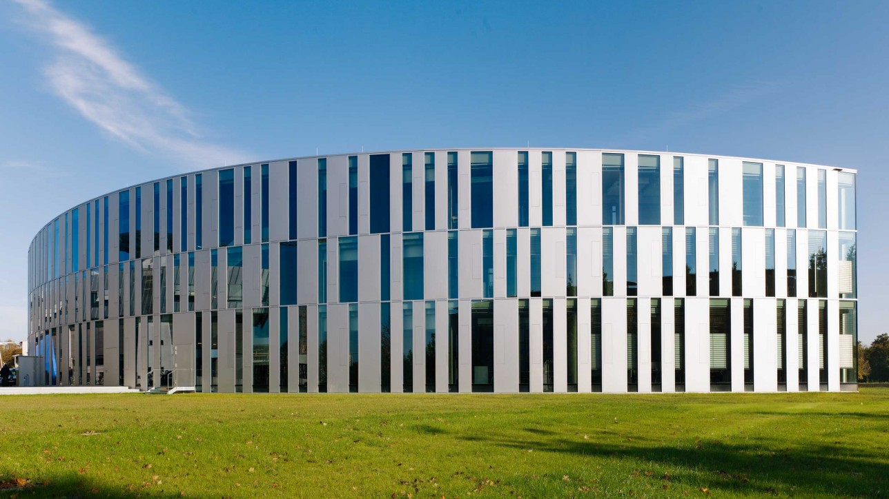
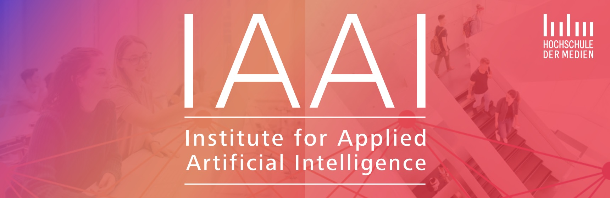

+++
# A Demo section created with the Blank widget.
# Any elements can be added in the body: https://sourcethemes.com/academic/docs/writing-markdown-latex/
# Add more sections by duplicating this file and customizing to your requirements.

widget = "blank"  # See https://sourcethemes.com/academic/docs/page-builder/
headless = true  # This file represents a page section.
active = true # Activate this widget? true/false
weight = 20  # Order that this section will appear.

title = ""
subtitle = ""

[design]
  # Choose how many columns the section has. Valid values: 1 or 2.
  columns = "1"

[design.background]
  # Apply a background color, gradient, or image.
  #   Uncomment (by removing `#`) an option to apply it.
  #   Choose a light or dark text color by setting `text_color_light`.
  #   Any HTML color name or Hex value is valid.

  # Background color.
  # color = "navy"

  # Background gradient.
  # gradient_start = "DeepSkyBlue"
  # gradient_end = "SkyBlue"

  # Background image.
  image = ""  # Name of image in `static/img/`.
  image_darken = 0.2  # 0.6 Darken the image? Range 0-1 where 0 is transparent and 1 is opaque.

  # Text color (true=light or false=dark).
  text_color_light = false

[design.spacing]
  # Customize the section spacing. Order is top, right, bottom, left.
  padding = ["20px", "0", "20px", "0"]

[advanced]
 # Custom CSS.
 css_style = ""

 # CSS class.
 css_class = ""
#css_class = "mini"
+++

I studied business administration with a focus on operations research and quantitative marketing at the [University of Tübingen](https://uni-tuebingen.de/fakultaeten/wirtschafts-und-sozialwissenschaftliche-fakultaet/faecher/).

Afterwards, I received my doctoral degree from the [University of Zurich](https://www.uzh.ch/de.html) (2010). During my doctoral studies, I attended quantitative methods and programming courses at the University of Zurich, [London School of Economics and Political Science](http://www.lse.ac.uk) (GB) and the [University of Michigan](https://umich.edu) (USA).

Before joining HdM Stuttgart as a Professor, I gained over 10 years of professional experience in data science, e.g. as data science consultant and head of customer lifecycle management at Serviceplan Group.

I'm also a member of the [Institute for Applied Artificial Intelligence](https://ai.hdm-stuttgart.de) at HdM, where we support and consult organizations with the implementation of artificial intelligence solutions into enterprise applications.
